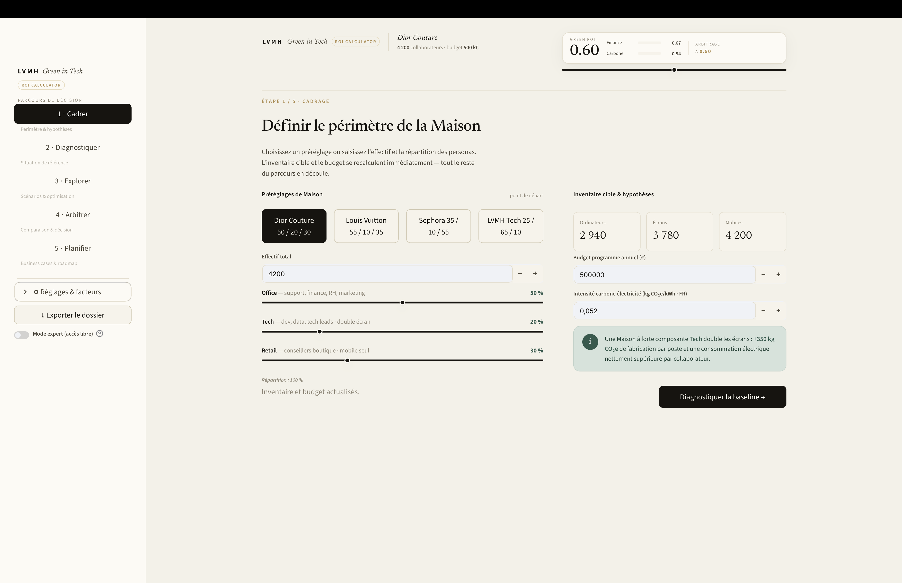
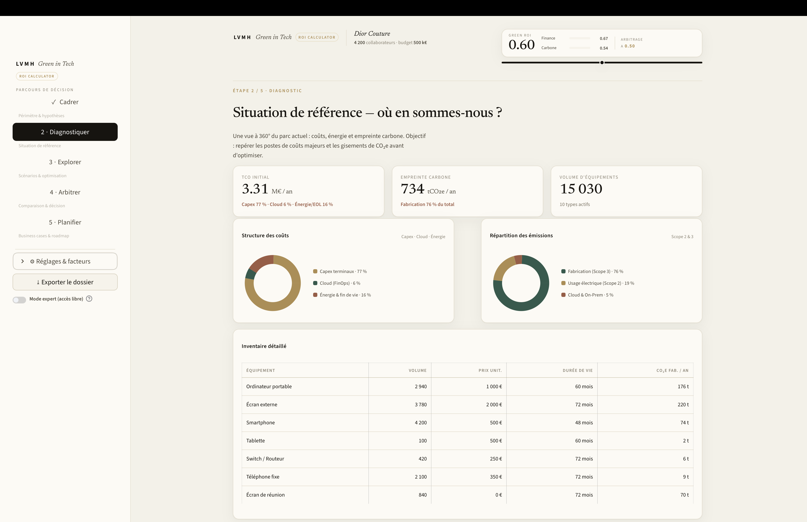
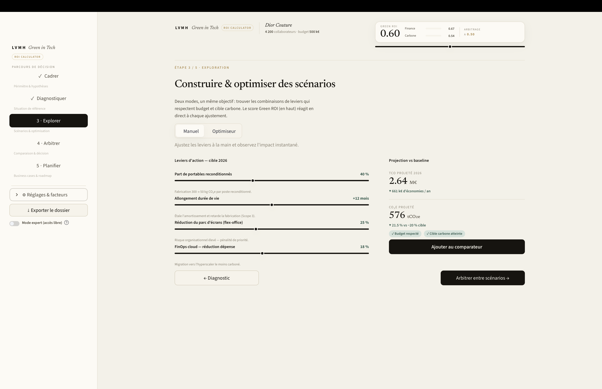
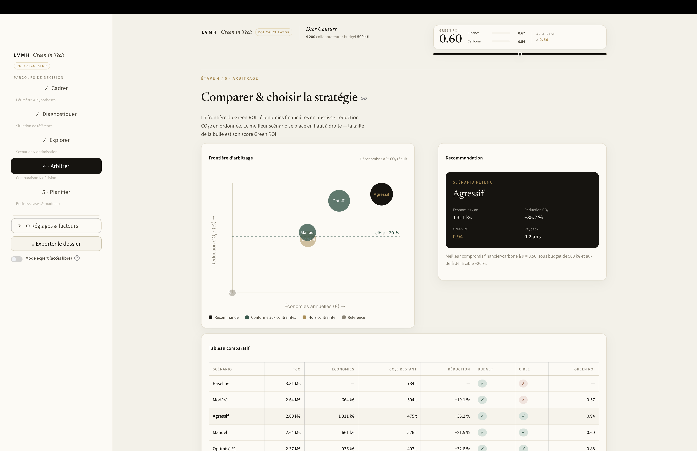
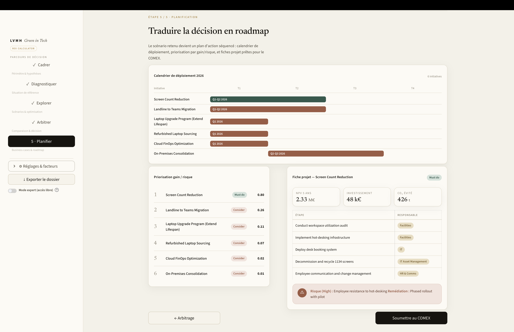

# LVMH — Green in Tech · ROI Calculator

> Un outil d'aide à la décision qui aide une Maison LVMH à **arbitrer** entre
> performance financière et impact carbone de son parc IT, et à transformer cet
> arbitrage en **feuille de route**.


---

## Sommaire

1. [Le sujet](#1-le-sujet)
2. [La solution & le parcours utilisateur](#2-la-solution--le-parcours-utilisateur)
3. [Le fonctionnement de l'optimisation](#3-le-fonctionnement-de-loptimisation)
4. [Le code (maquette)](#4-le-code-maquette)

---

## 1. Le sujet

Chaque Maison du groupe LVMH s'appuie sur un **parc informatique** important :
ordinateurs portables, écrans, smartphones, téléphonie fixe, équipements réseau, le tout
complété par des ressources **cloud** et **on-premises**. Ce parc a un double coût, et
c'est là que naît le problème.

**Un coût financier.** Le *Total Cost of Ownership* (TCO) cumule l'amortissement des
terminaux (Capex), l'énergie, la facture cloud et les coûts de fin de vie. Pour une
Maison de quelques milliers de collaborateurs, il se chiffre en **millions d'euros par
an**.

**Un coût carbone.** Le parc IT émet du CO₂e, et — point contre-intuitif mais décisif —
**l'essentiel des émissions provient de la *fabrication* des terminaux** (Scope 3), pas de
leur consommation électrique. Sur un réseau électrique aussi décarboné que le réseau
français, « éteindre les écrans la nuit » ne change presque rien ; ce qui compte, c'est de
**fabriquer moins** : allonger la durée de vie des appareils, acheter du **reconditionné**,
réduire le nombre d'équipements par poste.

**Une cible à tenir.** Les engagements RSE imposent une trajectoire de réduction — par
exemple **−20 % de CO₂e d'ici 2026** — tout en restant dans une **enveloppe budgétaire**
annuelle fixée.

**La vraie difficulté est l'arbitrage.** Les deux objectifs ne sont pas alignés :

- le levier le plus **économique** n'est pas forcément le plus **décarbonant** ;
- certains gestes très verts (ex. flex-office pour réduire les écrans) portent un **risque
  organisationnel** ;
- le budget impose de **choisir** : on ne peut pas tout faire la même année.

Un décideur a donc besoin de répondre à une question simple à formuler mais difficile à
trancher : *« quelle combinaison d'initiatives me donne le meilleur compromis euros / CO₂,
sans dépasser le budget, tout en atteignant la cible ? »* — et de pouvoir **défendre ce
choix devant un COMEX**, chiffres à l'appui.

C'est exactement ce que cet outil produit.

---

## 2. La solution & le parcours utilisateur

### Le principe : un score d'arbitrage réglable

L'outil ramène les deux dimensions à une grandeur commune, le **Green ROI**, qui combine un
score **financier** et un score **carbone** via un curseur d'arbitrage **α** :

$$\text{Green ROI} = \alpha \cdot \text{Finance} + (1 - \alpha)\cdot \text{Carbone}$$

- `α = 1` → décision **purement financière** ;
- `α = 0` → décision **purement environnementale** ;
- `α = 0,5` → **équilibre**.

Une **jauge** en haut de l'écran affiche ce score en permanence et **réagit en direct** à
chaque réglage : déplacer un levier ou le curseur α recompose immédiatement le Green ROI.
L'arbitrage, d'habitude implicite, devient **visible et manipulable**.

### Le parcours en cinq phases

L'application guide l'utilisateur du cadrage à la roadmap. Une barre latérale (le *rail de
décision*) matérialise la progression ; une *topbar* persistante rappelle le contexte
(Maison, effectif, budget) et porte la jauge Green ROI.

**Phase 1 — Cadrer** · *définir le périmètre.*
On choisit un préréglage de Maison (Dior Couture, Louis Vuitton, Sephora, LVMH Tech) ou on
saisit l'**effectif** et la **répartition des personas** (Office / Tech / Retail). L'outil
en déduit l'**inventaire cible** : un poste Office a un écran, un poste Tech en a deux
(double écran), le Retail est « mobile seul ». Budget et intensité carbone de l'électricité
se règlent ici.




**Phase 2 — Diagnostiquer** · *où en sommes-nous ?*
Une photographie du parc actuel : **TCO**, **empreinte carbone** et **volume** en chiffres
clés ; deux anneaux montrant la **structure des coûts** (Capex / Cloud / Énergie) et la
**répartition des émissions** (Fabrication / Usage / Cloud & On-Prem) ; un **inventaire
détaillé**. Le but est de repérer les **postes de coûts** et les **gisements de CO₂** avant
d'agir.




**Phase 3 — Explorer** · *construire des scénarios.*
Deux façons de travailler :

- **Manuel** — quatre leviers (part de reconditionnés, allongement de durée de vie,
  réduction du parc d'écrans, FinOps cloud). La projection (TCO, économies, CO₂, % de
  réduction) et les pastilles **budget / cible** se mettent à jour en direct.
- **Optimiseur** — l'algorithme balaie **des milliers de combinaisons**, ne garde que
  celles qui respectent budget **et** cible, et propose un **Top 5** de stratégies
  distinctes classées par Green ROI.




**Phase 4 — Arbitrer** · *comparer et choisir.*
La **frontière d'arbitrage** place chaque scénario sur un plan « économies × réduction
CO₂ » (le meilleur est en haut à droite, la taille de la bulle est son Green ROI). Une
**carte de recommandation** désigne le scénario retenu et un **tableau comparatif** met en
regard Baseline, Modéré, Agressif, Manuel et Optimisé, avec le respect des contraintes.




**Phase 5 — Planifier** · *passer à l'action.*
Le scénario retenu devient une **roadmap 2026** : calendrier de déploiement (gantt
trimestriel), **priorisation gain/risque** (Must do / Should do / Consider) et **fiches
projet** prêtes pour le COMEX (VAN, investissement, CO₂ évité, étapes, responsables,
risques et remédiations).




### En complément

Un mode **expert** déroule les cinq phases d'affilée ; un bouton **exporte** la décision en
Markdown ; un panneau **Réglages** permet d'ajuster la cible carbone et les hypothèses
on-prem.

---

## 3. Le fonctionnement de l'optimisation

En mode **Optimiseur**, le moteur fait quelque chose de simple à décrire : il **essaie
toutes les combinaisons de leviers, calcule un score pour chacune, et garde les
meilleures**. Voici, étape par étape, ce qu'il calcule vraiment.

### Étape 1 — Les leviers testés

Six leviers, chacun pris dans une courte liste de valeurs :

| Levier | Valeurs essayées |
|--------|------------------|
| Part de portables reconditionnés | 0 · 20 · 40 · 60 % |
| Allongement de la durée de vie | 0 · +6 · +12 · +18 mois |
| Réduction du parc d'écrans | 0 · 10 · 20 · 30 · 40 % |
| Retrait des téléphones fixes | 0 · 50 · 100 % |
| FinOps cloud (baisse de la facture) | 0 · 10 · 15 · 20 · 25 % |
| Optimisation on-prem | 0 · 5 · 10 · 15 % |

En multipliant le nombre de valeurs de chaque levier, on obtient toutes les combinaisons :

```
4 × 4 × 5 × 3 × 5 × 4  =  4 800 scénarios testés
```

### Étape 2 — Le coût et le CO₂ de chaque scénario

Pour une combinaison, on recalcule le parc à partir de deux briques simples :

```
Coût annuel d'un équipement  =  (nombre × prix)         ÷ durée de vie (années)
CO₂ de fabrication annuel    =  (nombre × facteur CO₂)  ÷ durée de vie (années)
```

Les leviers ne font que modifier ces quantités :
- **reconditionné** → baisse le prix d'achat **et** le facteur CO₂ de fabrication ;
- **+mois de vie** → augmente la durée de vie (donc baisse les deux montants annuels) ;
- **−écrans / −fixes** → baisse le nombre d'appareils ;
- **FinOps / on-prem** → baisse la facture cloud et les émissions serveurs.

On additionne ensuite tout le parc :

```
TCO du scénario  =  coûts annualisés + énergie + cloud + fin de vie
CO₂ du scénario  =  fabrication + usage électrique + cloud + on-prem
```

### Étape 3 — Le score Green ROI de chaque scénario

**1) Le gain par rapport à aujourd'hui**

```
Économies (€)   =  TCO actuel − TCO du scénario
Réduction CO₂   =  (CO₂ actuel − CO₂ du scénario) ÷ CO₂ actuel
```

**2) Les deux scores, ramenés entre 0 et 1**

```
score Finance   =  Économies ÷ (30 % du TCO actuel)    → plafonné à 1
score Carbone   =  Réduction ÷ 40 %                     → plafonné à 1
```

Autrement dit : économiser **30 % du TCO** *ou* réduire de **40 %** donne le score plein (1).

**3) La combinaison, réglée par le curseur α**

```
Green ROI  =  α × score Finance  +  (1 − α) × score Carbone
```

(`α` = 0 → tout carbone · `α` = 1 → tout finance · `α` = 0,5 → équilibre.)

### Étape 4 — On filtre, puis on classe

Une combinaison n'est **retenue** que si elle respecte les deux contraintes :

```
investissement ≤ budget        ET        Réduction CO₂ ≥ cible (ex. 20 %)
```

Les combinaisons retenues sont **triées par Green ROI décroissant** ; on retire les
quasi-doublons (celles qui ne diffèrent que par un levier sans effet visible) et on affiche
le **Top 5**.

### Exemple chiffré (Dior Couture, α = 0,5)

Scénario recommandé par l'optimiseur (reconditionné élevé + réduction des écrans +
allongement de la durée de vie) :

```
TCO actuel       =  3,31 M€              CO₂ actuel    =  734 t
TCO du scénario  =  2,37 M€              CO₂ scénario  =  493 t

Économies      =  3,31 − 2,37            =  0,94 M€  (936 k€)
Réduction CO₂  =  (734 − 493) ÷ 734      =  32,8 %

score Finance  =  936 k€ ÷ (30 % × 3,31 M€)  =  936 ÷ 993  =  0,94
score Carbone  =  32,8 % ÷ 40 %                            =  0,82
Green ROI      =  0,5 × 0,94  +  0,5 × 0,82                =  0,88
```

> En Phase 5, chaque initiative retenue est ensuite valorisée par sa **VAN à 5 ans** (les
> économies futures actualisées à 5 % par an) et classée **Must do / Should do / Consider**
> selon un score mêlant gain et risque.

---

## 4. Le code (maquette)

> ⚠️ **Ce dépôt est une maquette / preuve de concept.** Les facteurs d'émission ADEME et
> certains prix sont des **valeurs illustratives** à affiner avant tout usage réel, et
> l'optimiseur est une **recherche par grille** (heuristique), pas un solveur exact. Les
> chiffres servent à valider l'expérience et le modèle de décision, pas à produire un
> reporting carbone certifié.

### Prérequis
- Python 3.8 ou supérieur
- Connexion internet (dépendances + polices Google Fonts)

### Installation

```bash
git clone <votre-url-de-repo>
cd lvmh-green-roi-calculator
pip install -r requirements.txt
```

Dépendances (`requirements.txt`) : `streamlit`, `pandas`, `openpyxl`, `numpy`, `scipy`,
`plotly`.

### Lancement

```bash
streamlit run app.py
```

L'application s'ouvre sur **http://localhost:8501**. Les données par défaut sont chargées
depuis `data/UC1_Inputs.xlsx` (recréé automatiquement s'il est absent).

### Structure du projet

```
app.py                  Interface Streamlit — parcours en 5 phases
assets/theme.css        Design system éditorial + overrides Streamlit
data/UC1_Inputs.xlsx    Données d'entrée (volumes, prix, durées de vie, conso)
src/
  config.py             Facteurs ADEME, paramètres globaux, personas, initiatives
  data_loader.py        Lecture Excel → EquipmentData
  baseline.py           TCO & empreinte de référence (§3.1)
  scenario.py           Projection des scénarios / leviers (§3.2)
  roi.py                ROI financier, environnemental, score Green ROI (§3.3–3.4)
  optimizer.py          Recherche par grille + classement (§3.5)
  business_case.py      Business cases, VAN, priorisation (§3.6)
DOCUMENTATION.md        Documentation détaillée du modèle
```

L'interface ne fait que **préparer les entrées, appeler le moteur `src/` et mettre en
forme** (HTML/SVG) les résultats. Tout le calcul vit dans `src/`.

### Facteurs & hypothèses par défaut

Facteurs d'émission de fabrication (kg CO₂e), `src/config.py` :

| Équipement          | Neuf | Reconditionné | Usage               |
|---------------------|:----:|:-------------:|---------------------|
| Ordinateur portable | 300  | 50            | 50 kWh/an           |
| Smartphone          | 70   | 10            | 5 kWh/an            |
| Écran               | 350  | 60            | calculé (puissance) |
| Tablette            | 100  | 15            | 15 kWh/an           |
| Switch / Routeur    | 80   | 15            | 100 kWh/an          |
| Écran de réunion    | 500  | 80            | 200 kWh/an          |

- **Électricité (FR)** : 0,052 kg CO₂e/kWh · **Cloud** (kg CO₂e/€) : Azure 0,0004 ·
  GCP 0,0003 · AWS 0,00035 · Alternative 0,0002.
- **Défauts** : budget 500 000 €/an · cible −20 % · fin de vie 5 000 €/an · base on-prem
  34 000 kg/an · α = 0,50.
- Portable Dell (contrat) : neuf 700 €, reconditionné 850 €.
- Écran : 0,16 kW allumé / 0,005 kW veille · 8 h / 16 h · prix 0,2016 €/kWh
  (soit ≈ 496 kWh/an).

### Limites connues

- Facteurs ADEME **approximatifs** (données publiques), destinés à être ajustés.
- Optimiseur = **recherche par grille**, pas solveur exact.
- **Écart de prix portable** : la baseline valorise le portable au prix Excel (1 000 €)
  alors que les scénarios appliquent le tarif contrat Dell (700 €) ; un scénario « sans
  changement » affiche donc déjà ~176 k€ d'« économies » (quirk du moteur existant).
- **Streamlit** : la jauge se met à jour au *rerun* (pas de transition CSS continue) et la
  topbar n'est pas *sticky*.

---


*Préparé pour la Direction IT du Groupe LVMH — maquette d'aide à la décision Green IT.*

